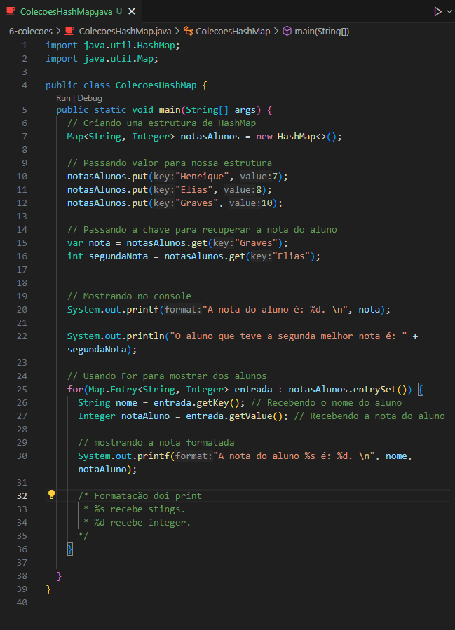

<h1 align="center">HashMap</h1>

  - ``HashMap`` é uma ``estrutura de dados`` do Java que permite armazenar pares de ``chave`` e ``valor``. <br>
  É importante respeitar os tipos de chave e valor definidos ao adicionar elementos ao HashMap.

___
  

  - Na ``linha 7`` nós criamos uma estrutura de ``HashMap``. <br>
    Assim que chamamos o ``Map`` precisamos passar dentro dele qual será o tipo da chave e valor que ele receberá, nesse caso ele receberá uma ``chave do tipo String`` e um ``valor do tipo Integer``.
    Após isso nós criamos o nome do nosso mapa e dizemos ao Java que o nome ``notasAlunos`` é um novo HashMap com o comando ``new HashMap<>()``.

  - ``.put( )`` <br>
    Serve para ``adicionar dados`` dentro do nosso mapa. <br>
    Podemos ver isso nas ``linhas 10 a 12``, para ``add dados`` nós chamamos o ``.put( )`` após o`` nome do nosso mapa`` e dentro dele ``add uma Key`` com o ``nome da nossa chave`` e depois uma ``value`` com o ``nosso valor``.

  - ``.get( )`` <br>
    Ele serve para podermos ``acessar um dado`` usando a nossa ``Key``. <br>
    Podemos ver isso nas linhas 16 e 17, dentro do nosso ``.get( )`` nós adicionamos a ``Key`` que desejamos visualizar o seu ``value``. <br>
    
    Aqui podemos ver duas coisas legais, a primeira seria na ``linha 16`` que usamos a palavra- chave ``var`` para definir o tipo de variavel automaticamente. Podemos utilizar o ``var`` quando já sabemos o tipo da variavel que iremos receber, se é uma ``String``, ``Int`` ou outra. <br>

    Já na ``linha 17`` nós declaramos que o valor recebido será um ``Integer`` para demonstrar que podemos ``usar as duas formas`` para declarar nossa variavel e ``ambas estão corretas``.

  Podemos também acessar os dados do nosso ``Map`` utilizando o For :

  - Na ``linha 25`` criamos o nosso for e dentro dele chamamos o ``Map.Entry`` e dizemos que ele receberá a ``chave do tipo string`` e ``valor do tipo Int``. <br>
    Depois criamos uma ``variavel``, nesse caso com ``nome de entrada`` para receber os valores da nossa ``Key`` e ``value``. <br>
    Depois disso usamos o ``.entrySet( )`` para fazer o nosso ``ForEach`` no nosso ``Map``.

  - Nas ``linhas 26 e 27`` criamos duas variaveis, a ``primeira`` receberá o valor da nossa ``Key`` e a segunda com nome de ``notaAluno`` receberá o ``value``.
    Para que isso aconteça nós chamamos a ``variavel entrada`` e depois usamos o método ``.getKey( )`` para receber a ``Key`` do nosso ``Map`` e o ``.get.Value( )`` para receber o value da nossa ``Key``.

  OBS: HashMap recebe ``chaves unicas``, caso seja passado uma ``mesma Key`` com um ``value diferente``, ele irá considerar o ``ultimo value`` como o value ``atual da Key``.
___
### Código Para Copiar :
  ```bash

    import java.util.HashMap;
    import java.util.Map;

    public class ColecoesHashMap {
      public static void main(String[] args) {
        // Criando uma estrutura de HashMap
        Map<String, Integer> notasAlunos = new HashMap<>();

        // Passando valor para nossa estrutura
        notasAlunos.put("Henrique", 7);
        notasAlunos.put("Elias", 8);
        notasAlunos.put("Graves", 10);

        // Passando a chave para recuperar a nota do aluno
        var nota = notasAlunos.get("Graves");
        int segundaNota = notasAlunos.get("Elias");


        // Mostrando no console
        System.out.printf("A nota do aluno é: %d. \n", nota);

        System.out.println("O aluno que teve a segunda melhor nota é: " + segundaNota);

        // Usando For para mostrar dos alunos
        for(Map.Entry<String, Integer> entrada : notasAlunos.entrySet()) {
          String nome = entrada.getKey(); // Recebendo o nome do aluno
          Integer notaAluno = entrada.getValue(); // Recebendo a nota do aluno

          // mostrando a nota formatada
          System.out.printf("A nota do aluno %s é: %d. \n", nome, notaAluno);

          /* Formatação doi print
          * %s recebe stings.
          * %d recebe integer.
          */
        }

      }  
    }

  ```

___