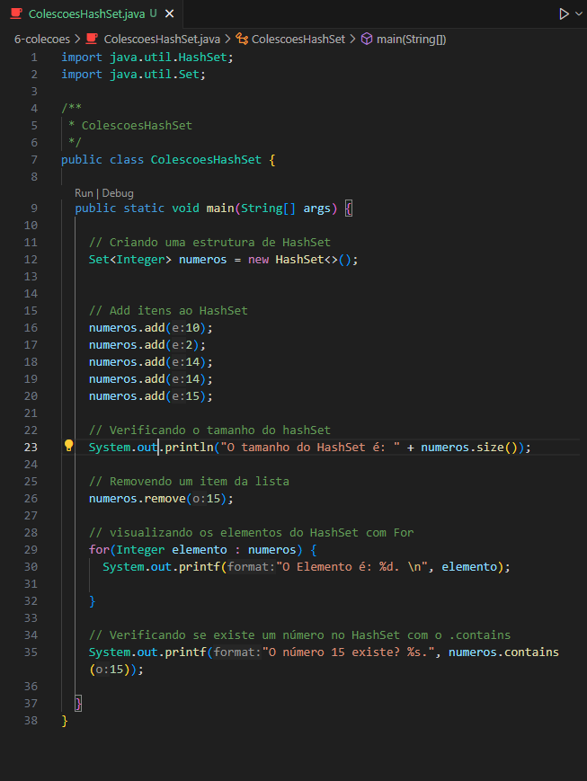

<h1 align="center">Conjuntos - HashSet</h1>

  - HashSet é uma coleção no Java que armazena ``elementos únicos``.

  - Ao contrário do HashMap, que possui uma ``chave`` e um ``valor``, o ``HashSet só armazena o valor``.
  
  - Podemos ``adicionar`` elementos ao HashSet usando o método ``.Add( )`` e ``remover`` elementos usando o método ``.remove( )``.
  
  - Também podemos ``verificar se um elemento existe`` no HashSet usando o método ``Contains``. 
  
  - Ao contrário de uma lista, o HashSet ``não mantém`` uma ``ordem específica`` dos elementos e ``não podemos`` acessar elementos ``pelo índice``. 

  -  O HashSet é ``útil quando não precisamos`` de uma ``ordem específica`` e queremos garantir que os ``elementos sejam únicos``.

___


  - Na ``linha 12`` criamos a estrutura do nosso ``HashSet``. <br>
    Chamamos o ``Set<>`` e dentro dele dizemos o ``tipo de valor`` que ele receberá, nesse caso um ``Integer``. <br>
    Depois criamos o ``nome do nosso HashSet`` e dizemos ao Java que a ``variavel numeros`` será um HashSet com o comando ``new HashSet<>()``.

  - ``.add( )``
    Serve para ``adicionar`` valores dentro do HashSet. <br>
    Podemos ver isso nas ``linhas 16 a 20``, chamamos o ``.add( )`` após a nossa variavel ``numero`` e adicionamos o valor que será recebido.

  - ``.size( )``
    Serve para consultarmos o tamanho do nosso HashSet. <br>
    Podemos ver isso na linha 23.
  	
  - ``.remove( )``
    Serve para ``remover`` um valor dentro do HashSet. <br>
    Podemos ver isso na ``linha 26``, chamamos ela depois da nossa ``variavel`` e declaramos dentro do ``.remove( )`` o valor que queremos remover.

  - Na ``linha 29`` usamos o ``For`` para ``visualizar`` todos os valores adicionados no nosso ``HashSet``.
    Lembrando que ``valores repetidos`` não serão mostrados duas vezes, o HashSet considera ``valores unicos``.
  
  - ``.contains``
    Serve para ``verificar se existe`` um valor dentro do nosso HashSet.
    Para usa-lo precisamos apenas ``declara-lo`` após nossa ``variavel`` e dentro do ``.contains( )`` adicionamos o valor que queremos verificar. <br>
    Podemos ver isso na ``linha 35``.

___
Código para Copiar :
  ```bash

    import java.util.HashSet;
    import java.util.Set;

    /**
    * ColescoesHashSet
    */
    public class ColescoesHashSet {

      public static void main(String[] args) {

        // Criando uma estrutura de HashSet
        Set<Integer> numeros = new HashSet<>();


        // Add itens ao HashSet
        numeros.add(10);
        numeros.add(2);
        numeros.add(14);
        numeros.add(14);
        numeros.add(15);

        // Verificando o tamanho do hashSet
        System.out.println("O tamanho do HashSet é: " + numeros.size());

        // Removendo um item da lista
        numeros.remove(15);

        // visualizando os elementos do HashSet com For
        for(Integer elemento : numeros) {
          System.out.printf("O Elemento é: %d. \n", elemento);

        }

        // Verificando se existe um número no HashSet com o .contains
        System.out.printf("O número 15 existe? %s.", numeros.contains(15));

      }
    }

  ```

___