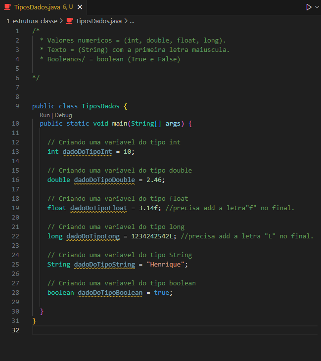

<h1 align="center">Tipo de Dados em Java</h1>

  - Aqui vamos aprender como declarar os principais tipos de dados mais usados.

  Os tipos de dados que aparecerão aqui serão:
  - int.
  - double.
  - float.
  - long.
  - String.
  - boolean.

___
<h3>Como Declarar as Variaveis de Cada Tipo :</h3>
  

  - Dentro da nossa classe, nós criamos um exemplo para cada tipo.

  - Em Java uma variavel deve ser declarada usando o estilo ``camelCase``.

  - Precisa também dizer ``antes do nome da variavel`` qual o ``tipo de dado`` que ela receberá, como podemos ver no exemplo acima que todas as variaveis estão especificando qual o tipo de dado recebido.

  - Então a declaração basicamente seria o ``tipo de dado`` > seguido do ``nome da variavel`` > e depois o dado no final, após o simbolo de ``=``.

  - Os dados do tipo ``float`` precisa ter uma letra ``f`` após o número para que o ``Java não de um erro de compilação``.  
  Pois por padrão o Java identifica ``os dados de tipo flutuantes como double``, utilizando o ``f`` no final, ele consegue identificar essa diferença.

  - Os dados de tipo ``long`` são números inteiros como o do tipo ``int``. 
  A diferença aqui é que ``os dados long são para números maiores``, que possuem muitos caracteres.  
  Já ``os dados de tipo int são para números menores`` com poucos caracteres, isso ajuda na parte de armazenamento de bits da nossa aplicação.

___
