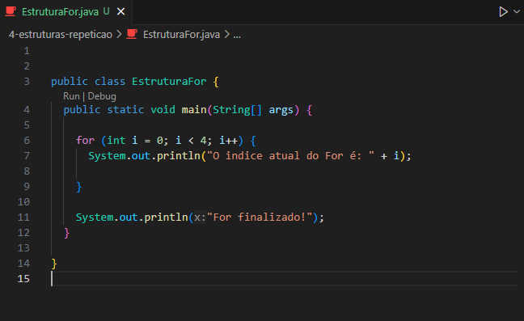
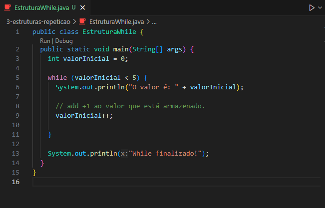
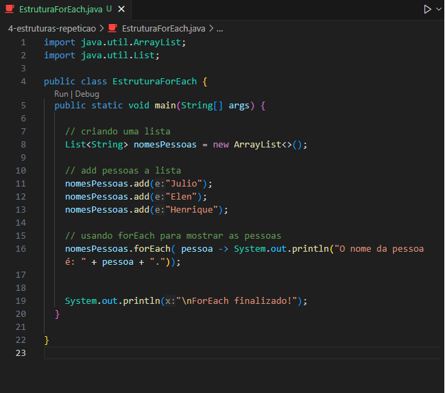

<h1 align="center">Estruturas de Repetição em Java</h1>

  - Agora iremos falar uma pouco sobre ``estruturas de repetição`` e como declaramos elas em Java.

  As Estruturas de Repetição :
  
  - For.
  - While.
  - ForEach.

  ___
  ### Estrutura de Repetição For :
   

  O For é para criar Loops que serão repetidos até que a condição passada para ele seja atendida, assim ele será finalizado.

  - Na ``linha 6`` passamos ao nosso for uma ``variavel i`` que recebe o número 0.

  - Depois ``passamos`` a nossa ``codição`` dizendo que ``enquanto a variavel i for menor que 4`` nós executaremos o que tem dentro do For.

  - por ultimo nós ``adicionamos +1`` a nossa ``variavel i``, usando o ``i++``.

  ___
  ### Estrutura de Repetição While :
  
  
  - Na linha 5  nós declaramos nossa condição ao While, ele será executado enquanto a ``variavel valorInicial`` for menor que 5.

  - ``Diferente do for`` que passamos o ``i++`` dentro da condição, no while nós podemos ``passar essa condição dentro do bloco``, como podemos ver na ``linha 9``. 

  O While é parecido com o For, ele é mais flexível quando não sabemos exatamente quantas iterações serão necessárias. 
  
  Você pode ajustar a condição durante a execução, isso é útil quando você deseja que um bloco de código seja executado enquanto uma condição específica seja verdadeira.

  Por Exemplo eu posso executar o While enquanto o nome ``João`` não for digitado.

  ___
  ### Estrutura de Repetição ForEach :
  

  - Nós criamos uma ``lista`` na ``linha 8`` e add strings a ela, na linha 11, 12 e 13.

  - Na ``linha 16`` nós chamamos o nosso ``ForEach junto com a lista`` que desejamos percorrer.

  - Diferente do ``for`` o ``foreach`` é chamado junto com uma lista ou array.

  - Dentro dele nós passamos uma ``variavel chamada pessoa``, que ira receber cada item da nossa lista.

  - E depois nós adicionamos um ``traço com seta (->)`` e usamos um print para mostrar o que tem em cada posição da nossa lista de forma simples.

  O ForEach é bem parecido com o For, más a utilização dele é mais simplificada.

  Ele é utilizada para percorrer ``arrays``, ``listas``, ``conjuntos`` de maneira simples. 
  
  É especialmente útil quando você deseja ``mostrar todos os elementos`` da lista sem se preocupar com os ``índices ou posições``.

  ___
  ### Código Para Copiar :

  #### Estrutura For: 
  ```bash

    public class EstruturaFor {
      public static void main(String[] args) {
        
        for (int i = 0; i < 4; i++) {
          System.out.println("O indice atual do For é: " + i);
          
        }

        System.out.println("For finalizado!");
      }
      
    }
  
  ```

  #### Estrutura While :
  ```bash
  
    public class EstruturaWhile {
      public static void main(String[] args) {
        int valorInicial = 0;

        while (valorInicial < 5) {
          System.out.println("O valor é: " + valorInicial);

          // add +1 ao valor que está armazenado.
          valorInicial++;
          
        }

        System.out.println("While finalizado!");
      }
    }

  
  ```

  #### Estrutura do ForEach :
  ```bash

    import java.util.ArrayList;
    import java.util.List;

    public class EstruturaForEach {
      public static void main(String[] args) {

        // criando uma lista
        List<String> nomesPessoas = new ArrayList<>();

        // add pessoas a lista
        nomesPessoas.add("Julio");
        nomesPessoas.add("Elen");
        nomesPessoas.add("Henrique");
        
        // usando forEach para mostrar as pessoas
        nomesPessoas.forEach( pessoa -> System.out.println("O nome da pessoa é: " + pessoa + "."));


        System.out.println("\nForEach finalizado!");
      }
      
    }

  ```