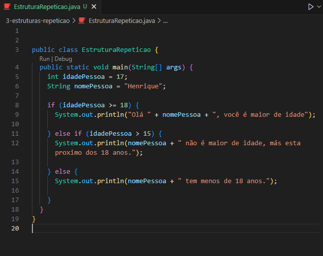

<h1 align="center">Estruturas Condicionais em Java</h1>

  - Aqui iremos aprender sobre as ``estruturas condicionais`` e como são declaradas em Java.

  As estruturas Condicionais são :

  - if.
  - else if.
  - else.

  - As estruturas condicionais ``executam um bloco de código`` se a ``condição`` passada nela ``for verdadeira``, caso não ela ``pode ou não`` executar algum outro bloco de código.

  - O ``if`` e ``else if`` aceitam condições ``dentro de parenteses``, se caso uma das suas condições forem atendidas eles executarão algum comando.

  - Caso não sejam atendidas podemos usar o ``else`` para escrever um comando diferente.

  ___
  ### Exemplo de Estrutura if, else if e else :
  

  - Na ``linha 8`` nós criamos o ``if``, caso a variavel ``idadePessoa`` for igual ou maior que 18, ele executará no nosso terminal a mensagem passada dentro do if.

  - Na ``linha 11`` nós criamos o ``else if``, caso a variavel ``idadePessoa`` não seja maior ou igual a 18 más seja maior do que 15, ele executará no nosso terminal a mensagem passada dentro do else if.

  - Na ``linha 14`` nós criamos o ``else``, caso ``nenhuma das condições`` acima seja ``atendida/verdadeira``, o else será executado mostrando sua mensagem dentro dele.

  ___
  ### Código para Copiar :

  ```bash

    public class EstruturaCondicional {
      public static void main(String[] args) {
        int idadePessoa = 17;
        String nomePessoa = "Henrique";

        if (idadePessoa >= 18) {
          System.out.println("Olá " + nomePessoa + ", você é maior de idade");

        } else if (idadePessoa > 15) {
          System.out.println(nomePessoa + " não é maior de idade, más esta proximo dos 18 anos.");

        } else {
          System.out.println(nomePessoa + " tem menos de 18 anos.");
          
        }
      }
    }
  
  ```

___
