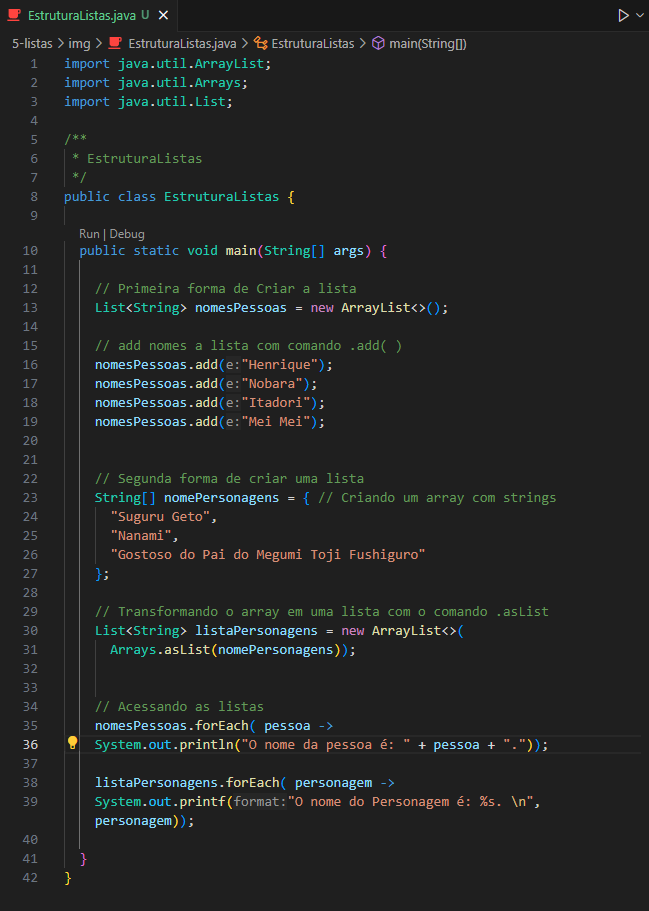
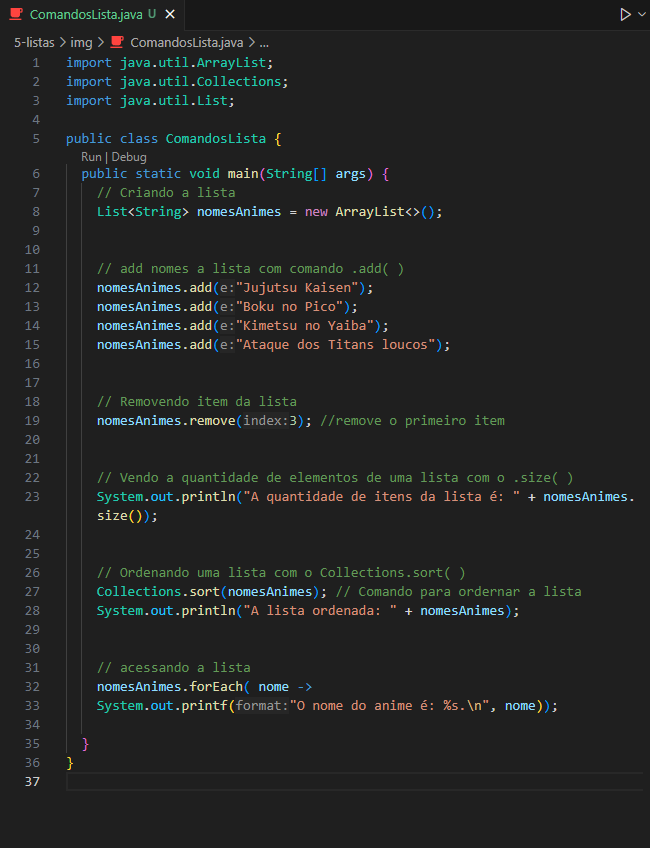
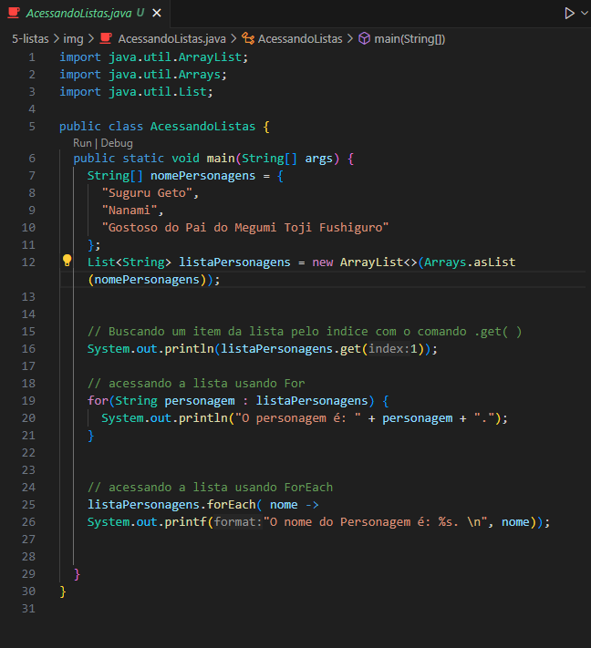

<h1 align="center">Listas em Java</h1>

  - Iremos aprender o básico sobre listas em Java agora, aqui iremos aprender a estrutura de uma lista, seus comandos basicos e como acessar uma lista.

  Tópicos Desse Estudo :
  
  - Estrutura de uma lista.
  - Comando para add um item a lista.
  - Comando para remover um item da lista.
  - Comando para saber a quantidade de itens da lista.
  - Comando para ordernar os itens da lista.
  - Como acessar um item da Lista.
  - Como acessar a lista usando o For.
  - Como acessar a lista usando o ForEach.

___
### Estrutura de uma lista :
  

  - Podemos criar uma lista de duas maneiras, criando a lista vazia e depois add itens nela e criando um array com itens e depois transformando ele em uma lista de fato.

  Primeira Forma :
  - Na ``linha 13`` nós criamos uma ``lista`` chamada ``nomePessoas``. <br>
  Em java precisamos declarar o tipo de itens que uma lista ira receber, nesse caso essa lista receberá itens do tipo ``String`` que é declarado dentro da propriedade ``List`` antes do nome da lista. <br>
  Após isso não chamamos um sinal de ``igual(=)`` e dizemos ao Java que a propriedade ``nomePessoas`` é um novo ``ArrayList`` com o comando ``new ArrayList<>( );``.

  - Depois de criamos nossa lista vazia, nós usamos o comando ``.add( )`` para add novos itens a lista, como aparece ``nas linhas 16 a 19``.

  Segunda Forma :
  - Na linha 23 nós criamos um ``array`` chamado ``nomePersonagens`` e dizemos ao Java que ele é um array de strings usando o comando ``String[]`` antes do nome do array.<br>
  Dentro dele passamos algumas ``Strings`` para compor a nossa lista.
  
  - Na ``linha 30`` nós criamos uma lista chamada ``listaPersonagens`` e chamamos o ``new ArrayList<>( )``. 

  - Dentro do nosso ``ArrayList<>( )`` nós chamamos a propriedade ``Array.asList( )`` e dizemos a ele que o array ``nomePersonagens`` fará parte da nossa listac ``listaPersonagens``.

___
### Comandos Basicos em Uma Lista :
  

  Os comandos basicos de uma lista são : 
  
  - ``.add( )`` <br>
    Serve para ``adicionarmos itens`` a nossa lista, podemos ver isso na ``linha 12 a 15``.

  - ``.remove( )`` <br>
    Serve para remover um item da lista, dizendo a sua posição na lista. <br>
    Podemos ver isso na ``linha 19``, nela estamos removendo o item na posição 3 da nossa lista.

  - ``.size( )`` <br>
    Serve para verificar-mos a ``quantidade de itens`` que tem dentro da nossa lista.
    Se usar-mos ele ``diretamente no print`` ele irá retornar o número com a quantidade de itens.

  - ``Collections.sort( )`` <br>
    O ``.sort( )`` serve para ordernar os itens da nossa lista, podemos usa-lo importando o ``Collections`` e assim chamando o ``.sort()`` e dizendo dentro dele qual a lista que iremos ordenar.
    Podemos ver isso na linha 27.

___
### Como Acessar uma Lista e Seus Itens :


Podemos acessar nossos itens de algums formas, irei deixar 3 formas, acessando um item diretamente diretamente, usando o For para ver os itens da lista e usando o ForEach para acessar os itens de forma mais simples.

- Na ``linha 16`` nós acessamos um item da lista usando o comando ``.get( )`` e passando dentro dele o ``número do item`` que desejamos acessar na lista.

- Na ``linha 19`` nós usamos o For ``para acessar todos`` os itens da lista. <br>
  Dentro do for nós criamos uma ``variavel local`` chamada ``personagem`` que irá receber cada item separadamente da lista ``ListaPersonagens`` em cada Loop que o ``For`` executar. <br>
  Dessa forma o ``For`` ira executar ``todos os itens``, ``um de cada vez`` até acabar a lista.
  
- Na ``linha 25`` usamos o ``ForEach`` para poder ``mostrar todos os itens`` da lista da mesma forma que o ``For``. <br>
  Da mesma forma que o For, dentro do ``ForEach`` nós criamos a ``variavel local`` chamada ``nome`` e usamos ela dentro do nosso ``print`` para mostrar ``cada item`` da nossa lista.

___
### Código Para Copiar :

  #### Estrutura de uma Lista :
  ```bash

    import java.util.ArrayList;
    import java.util.Arrays;
    import java.util.List;

    /**
    * EstruturaListas
    */
    public class EstruturaListas {

      public static void main(String[] args) {
        
        // Primeira forma de Criar a lista
        List<String> nomesPessoas = new ArrayList<>();

        // add nomes a lista com comando .add( )
        nomesPessoas.add("Henrique");
        nomesPessoas.add("Nobara");
        nomesPessoas.add("Itadori");
        nomesPessoas.add("Mei Mei");


        // Segunda forma de criar uma lista
        String[] nomePersonagens = { // Criando um array com strings
          "Suguru Geto",
          "Nanami", 
          "Gostoso do Pai do Megumi Toji Fushiguro"
        };

        // Transformando o array em uma lista com o comando .asList
        List<String> listaPersonagens = new ArrayList<>(
          Arrays.asList(nomePersonagens));

        
        // Acessando as listas
        nomesPessoas.forEach( pessoa ->
        System.out.println("O nome da pessoa é: " + pessoa + "."));

        listaPersonagens.forEach( personagem ->
        System.out.printf("O nome do Personagem é: %s. \n", personagem));

      }
    }

  ```

  #### Comandos Basicos em Uma Lista :
  ```bash
  
    import java.util.ArrayList;
    import java.util.Collections;
    import java.util.List;

    public class ComandosLista {
      public static void main(String[] args) {
        // Criando a lista
        List<String> nomesAnimes = new ArrayList<>();


        // add nomes a lista com comando .add( )
        nomesAnimes.add("Jujutsu Kaisen");
        nomesAnimes.add("Boku no Pico");
        nomesAnimes.add("Kimetsu no Yaiba");
        nomesAnimes.add("Ataque dos Titans loucos");


        // Removendo item da lista
        nomesAnimes.remove(3); //remove o primeiro item


        // Vendo a quantidade de elementos de uma lista com o .size( )
        System.out.println("A quantidade de itens da lista é: " + nomesAnimes.size());

        
        // Ordenando uma lista com o Collections.sort( )
        Collections.sort(nomesAnimes); // Comando para ordernar a lista
        System.out.println("A lista ordenada: " + nomesAnimes);


        // acessando a lista
        nomesAnimes.forEach( nome -> 
        System.out.printf("O nome do anime é: %s.\n", nome));

      }
    }

  ```

  #### Como Acessar uma Lista e Seus Itens :
  ```bash

    import java.util.ArrayList;
    import java.util.Arrays;
    import java.util.List;

    public class AcessandoListas {
      public static void main(String[] args) {
        String[] nomePersonagens = {
          "Suguru Geto",
          "Nanami", 
          "Gostoso do Pai do Megumi Toji Fushiguro"
        };
        List<String> listaPersonagens = new ArrayList<>(Arrays.asList(nomePersonagens));


        // Buscando um item da lista pelo indice com o comando .get( )
        System.out.println(listaPersonagens.get(1));

        // acessando a lista usando For
        for(String personagem : listaPersonagens) {
          System.out.println("O personagem é: " + personagem + ".");
        }


        // acessando a lista usando ForEach
        listaPersonagens.forEach( nome ->
        System.out.printf("O nome do Personagem é: %s. \n", nome));


      }
    }

  ```

____