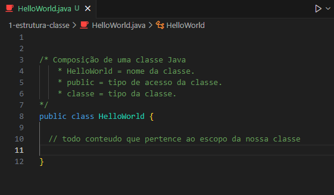
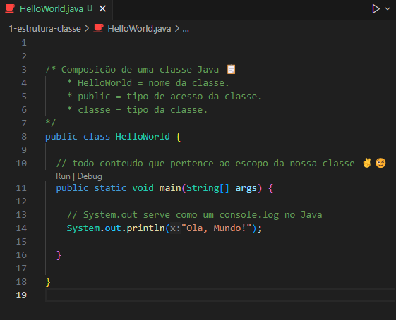

<h1 align="center">Estrutura de Uma Classe Java</h1>

  - Uma classe Java é criada com as primeiras letras do nome da classe em Maiusculo, como no exemplo abaixo ``HelloWorld``.

  - tanto o nome da classe quanto o arquivo.java tem o mesmo nome e com as primeiras letras Maiusculas.

  ___
  <h3>Estrutura da Classe Java :</h3>
  

  - Na linha 8 nós criamos a nossa classe, a classe criada tem os parametros ``public``, __class__ e o ``nome da classe``.

  - No Java temos que especificar se a classe é publica, privada ou se tem outro tipo de acesso, no caso acima ela é uma classe public.

  ___
  <h3>Estrutura Main Classe Java :</h3>
  

  - Dentro da nossa classe nós sempre temos que chamar o ``main()``.

  - O método main é o ponto de entrada para a execução do programa e precisa ser definido corretamente. 
  
  - A estrutura básica do método main inclui os modificadores de acesso public e static, o tipo de retorno void e o nome do método main. 
  
  - O parâmetro string args indica que podemos receber argumentos de lista do tipo string para o método. 
  
  - É essencial ter um método main para que o programa seja executado corretamente.

  - Dentro da nossa ``main()`` chamamos o ``System.out.println`` para retornar no nosso console um ``Olá mundo!``, esse método serve como um ``console.log``.

  ___
  <h3>Código Para Copiar :</h3>

  ```bash
    
    public class HelloWorld {

      // todo conteudo que pertence ao escopo da nossa classe ✌️😉
      
      public static void main(String[] args) {

        // System.out serve como um console.log no Java
        System.out.println("Ola, Mundo!");
      
      }

    }

  ```

___